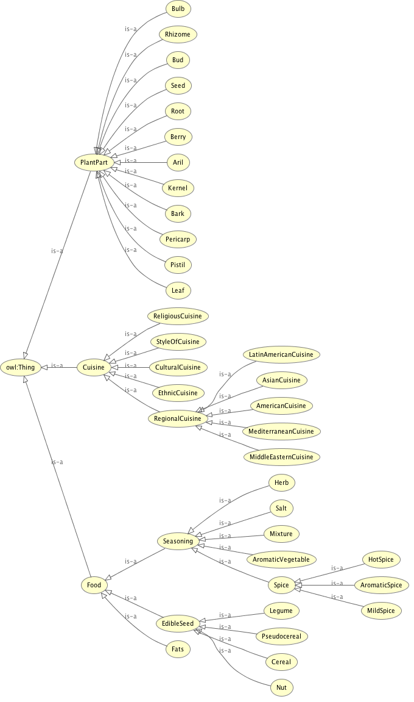

# Assignment 2: Ontology Development with Protégé

#### Remko Boschker s1282603

## Description

This ontology models the domain of the seasoning of food. It contains cuisines, spices, herbs and mixtures. Because the model starts to grow very large very fast I have limited the ontology (for now) to the spicy mixtures found on [cooksmarts.com](http://www.cooksmarts.com/articles/ultimate-infographic-guide-spices/)

And some of the classification is taken from chapter one in Handbook of Herbs and Spices edited by K.V. Peter, Woodhead Publishing 2001.

Because this ontology uses a lot of natural kinds (names of spices for instance), it becomes less clear what is an individual. In the case of a student with a particular number this seems pretty straight-forward. However with for instance Cinnamon I am not talking about a particular stick of cinnamon in my hand or a batch of cinnamon with a particular number in the belly of some cargo ship. For all intents and purposes of this ontology the names of a particular plant, herb or spice is taken to instantiate the class it belongs to.

The names of cuisines seems less of an issue as it is common the speak of the French cuisine et cetera and they are also taken to be individuals here. However there are some cuisines that form a group of cuisiness (eastern, Mediterranean, latin) The cuisines have a relations to a particular region indicated by the corresponding IRI of the dbpedia resource. The plant parts and taken to be classes, because whereas you can speak of the bark of a plant, in this ontology the cinnamon is a (piece of) bark.

https://www.w3.org/2007/OWL/wiki/Punning

### Linked Ontologies

dpr
dpo

### Individuals

#### Cuisines

* MexicanCuisine
* CaribbeanCuisine
* FrenchCuisine
* ItalianCuisine
* NorthAfricanCuisine
* MiddleEasternCuisine
* CajunCuisine
* ThaiCuisine
* Mediterranean
* LatinCuisine
* IndianCuisine
* MiddleEasternCuisine
* ChineseCuisine

* Mexican
  CorianderSeed
  Cumin
  Oregano
  Garlic
  Cinnamon
  ChiliPowder
* Caribbean
  Allspice
  Nutmeg
  Garlic
  Cloves
  Cinnamon
  Ginger
* French
  Nutmeg
  Thyme
  Garlic
  Rosemary
  Oregano
  Herbes de Provance
  Mirepoix
    Onion
    Carrots
    Celery
    butter
  parsely
  Bay Leaves
* North African
  Cardamon
  Cinnamon
  Cumin
  Paprika
  Turmeric
  Ginger
  Ras el Hanout
* Cajun
  Cayenne Pepper
  Oregano
  Paprika
  Thyme
  Rosemary
  Bay Leaves
  Cajun Seasoning
    onion
    Celery
    Green bell pepper
    olive oil
    butter
  Garlic
  parsely
  shalots
  paprika
* Thai
  Basil
  Cumin
  Garlic
  Ginger
  Turmeric
  Cardamom
  Curry Powder
  lemongrass
  Cilantro
  galangal
  kaffir lime
  peanut oil
  coconut milk
  shallots
  Chillies
* Mediterranean
  Oregano
  Rosermary
  Thyme
  Bay Leaves
  Cardamom
  Cinnamon
  Cloves
  Coriander
  Basil
  Ginger
* Indian
  Bay Leaves
  Cardamom
  Cayenne Pepper
  Cinnamon
  CorianderSeed
  Cumin
  Ginger
  Nutmeg
  Paprika
  Turmeric
  Garam Masala
  Curry Powder
  curry leaves
  Ghee
  Fenugreek
* Middle Eastern
  Bay Leaves
  Cardamom
  Cinnamon
  Cloves
  Cumin
  Ginger
  CorianderSeed
  Oregano
  Za'atar
  Garlic
  Saffron
  Onions
  Garlic
  Scallions

* Chinese
  Garlic
  Scallions
  Ginger
  peanut oil  
  Chillies
  shalots
  Chives
  Cilantro
  Chines five Spice
  Star Anise
* Italian
  Soffrito
    Onions
    Carrots
    Celery
    Olive Oil
  Garlic
  FennelSeed
  bayleaves
  parsley
  Sage
* latin
  Soffrito
    garlic
    onion
    bell Pepper
    olive oil
  Cilantro

#### Mixtures

#### AromaticVegetables

#### Salts

#### Spices

Allspice
Basil
Bay Leaves
Cardamom
Cayenne Pepper
Cinnamon
Cloves
Coriander
Cumin
Garlic
Ginger
Nutmeg
Oregano
Paprika
Rosemary
Thyme
Turmeric

onion, garlic, shallot, celery, bell pepper, carrot

CassiaCinnamon
CeylonCinnamon

Chili Powder
  Ancho Chile
  Paprika
  Cumin
  Mexican Oregano
Za'atar
  Thyme
  Sesame Seeds
  Sumac
Herbs de Provance
  Rosemary
  Marjoram
  Thyme
  Oregano
  Sage
  Tarragon
Garam Masala
  Cinnamon
  Nutmeg
  Cloves
  Cardamon
  Mace
  Black Peppercorns
  Coriander
  Turmeric
  Cumin

Ras el Hanout
  Cardamon
  Clove
  Cinnamon
  Paprika
  Coriander
  Cumin
  Nutmeg
  Black Peppercorns
  Turmeric
Curry Powder
  Turmeric
  Coriander
  Cumin
  Fenugreek
  Red Pepper
Cajun Seasoning
  Black Peppercorns
  Paprika
  Cumin
  Cayenne Pepper
  Thyme
Chinese Five Spice
  CassiaCinnamon
  Clove
  FennelSeed
  Star Anise
  Szechuan Peppercorns

### Class Hierarchy

* Cuisine
  * Regional
    * MediterraneanCuisine
    * LatinAmericanCuisine
    * AsianCuisine
    * AmericanCuisine
  * Cultural
* Food
  * Fats
  * Seasoning
    * AromaticVegetable
    * Herbs
    * Spice
      * AromaticSpice
      * HotSpice
      * MildSpice
    * Salt
    * Mixture
* PlantPart
  * Aril
  * Bark
  * Berry
  * Bulb
  * Kernel
  * Leaf
  * Pistil
  * Rhizome
  * Root
  * Seed

### Object Properties

uses, isUsedIn

contains, isContainedIn

isFromRegion, isFromCulture, hasCuisine

### Data Properties

## Queries

Give a description (in text and/or as diagrams) of your ontology.
Describe the classes, the subclasses, the properties, the constraints on properties and give examples of instances.
Document the SPARQL queries and the query results
